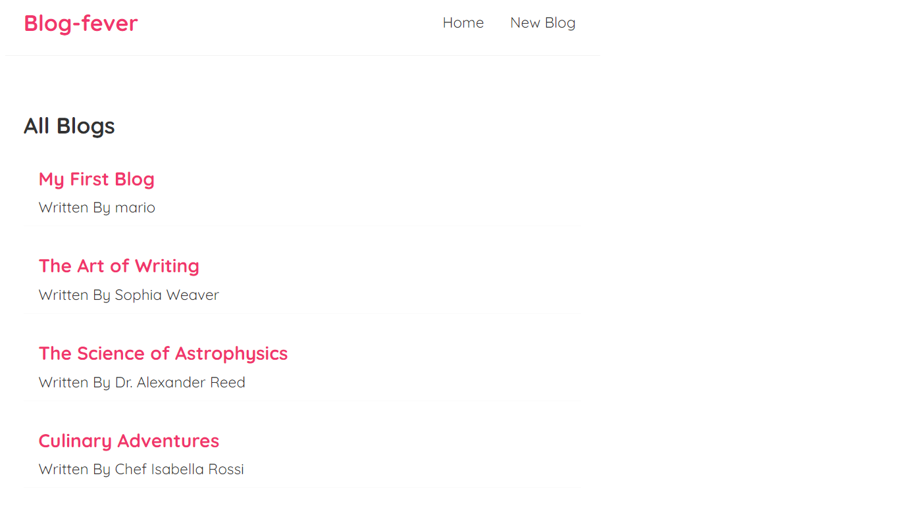
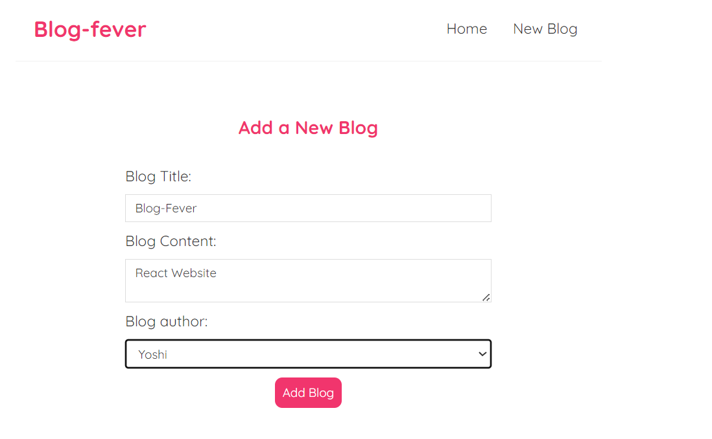
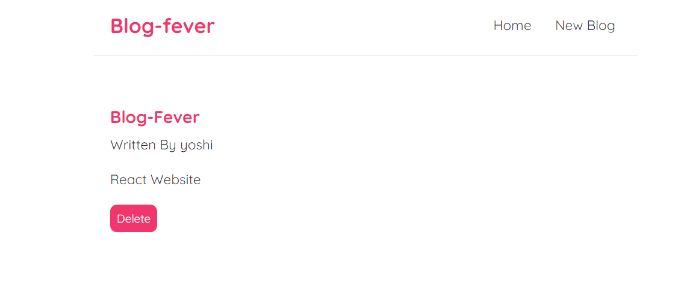

### BlogFever Website

The BlogFever Website is a responsive web application developed using React. Key features include article listing, detailed views, and seamless article management. React concepts like React Router, data fetching, and hooks (useState, useEffect, custom hooks) are implemented for an interactive and dynamic user experience. The website is designed to be responsive across devices, incorporating error handling, loading states, and efficient routing.

## Technical Stack

- **Technologies Used:** React, React Router, CSS ,JSON Server(for fake REST API)
- **Programming Languages:** JavaScript, JSX
- **Frameworks and Libraries:** Create React App (CRA),react-router-dom

To Run the project

1. Clone the Project
2. Run `npm install`
3. Run `npm start`

It Runs the app in the development mode.
Open [http://localhost:3000] to view it in your browser.

